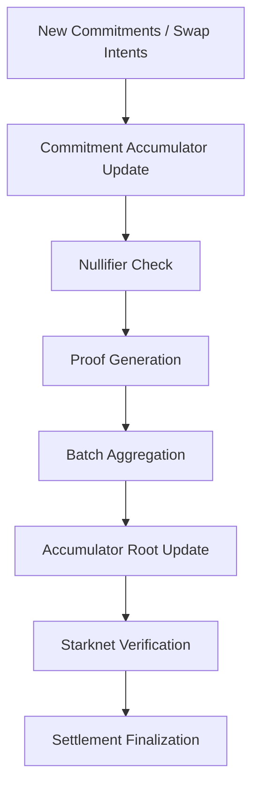

# BCYX Accumulators

> Commitment aggregation and batch verification layer for BCYX coordination.

---

## Overview

BCYX uses accumulators to compress many private swap, settlement, and oracle events into compact verifiable roots.

The accumulator layer is responsible for:
- storing commitments,
- tracking nullifiers,
- aggregating proofs,
- compressing state transitions,
- and reducing verification overhead.

It is a core part of the BCYX privacy architecture because it allows many hidden operations to be proven with a small public footprint.

---

## Why Accumulators Matter

Without accumulation, every swap or settlement would need to be verified separately.

That creates:
- higher verification cost,
- more on-chain data,
- more synchronization overhead,
- and weaker scalability.

With accumulators, BCYX can prove:

```text
many events
→ one root
→ one batch proof
→ one verification step
````

This is what makes confidential coordination practical.

---

## Core Role in BCYX

Accumulators sit between the private coordination layer and the public verifier.

They are used to:

* collect commitments from users,
* keep a canonical private execution state,
* prevent double-spending through nullifiers,
* batch multiple swap proofs,
* and expose only minimal settlement data on-chain.

---

## Main Accumulator Types

### 1. Commitment Accumulator

Tracks all active commitments in the system.

Used for:

* swap intents,
* locked BTC positions,
* shielded settlement entries,
* oracle commitments,
* and private disclosures.

Each new commitment updates the root.

---

### 2. Nullifier Accumulator

Tracks spent commitments.

Used to prevent:

* replay,
* double-use,
* duplicated settlement claims,
* and invalid reuse of the same private note.

If a nullifier already exists, the action is rejected.

---

### 3. Proof Accumulator

Aggregates many individual proofs into a single verifiable proof root.

Used for:

* batched swaps,
* batched settlement execution,
* batched compliance checks,
* and batched oracle attestations.

This reduces the number of verification operations required on Starknet.

---

### 4. Settlement Accumulator

Represents the current state of pending and completed settlement actions.

Used for:

* active swap queues,
* atomic release conditions,
* rollback states,
* and settlement finality tracking.

---

## Data Model

A simplified BCYX accumulator record may contain:

```text
AccumulatorRecord {
  root,
  height,
  commitment_root,
  nullifier_root,
  proof_root,
  settlement_root,
  updated_at,
}
```

The exact structure can evolve, but the design goal is always the same:
compress private state into a small, verifiable public summary.

---

## Update Flow



---

## How It Works

### Step 1 — Commit

A user submits a commitment representing a private action.

Example:

* BTC lock intent,
* strkBTC mint request,
* settlement condition,
* or disclosure predicate.

---

### Step 2 — Insert into Accumulator

The commitment is appended to the current accumulator state.

This changes the root without revealing the underlying data.

---

### Step 3 — Generate Nullifier

If the commitment is spent, a nullifier is generated and inserted into the nullifier accumulator.

This ensures the same private object cannot be spent twice.

---

### Step 4 — Batch Proof Construction

Multiple related actions are grouped together and proven as one batch.

This may include:

* swap matching,
* lock/release conditions,
* selective disclosure predicates,
* and state consistency checks.

---

### Step 5 — Public Verification

The verifier checks:

* root consistency,
* proof validity,
* and nullifier uniqueness.

Only the compressed accumulator state needs to be visible.

---

## Batch Proof Aggregation

A key BCYX goal is to avoid verifying every event separately.

Instead, accumulators allow:

```text
Tx1
Tx2
Tx3
Tx4
Tx5
↓
Single Batch Proof
↓
Single Root Verification
```

This is useful for:

* scaling swaps,
* lowering gas costs,
* and reducing coordination overhead.

---

## Relationship to BCYX-SWAP

In the BCYX-SWAP proof-of-concept:

* the commitment accumulator tracks active BTC and strkBTC swap intents,
* the nullifier accumulator prevents double execution,
* the proof accumulator compresses many swap validations,
* and the settlement accumulator tracks execution state.

That means the swap mechanism can remain private while still being auditable at the root level.

---

## Verification Properties

Accumulators must preserve:

### Integrity

The root must faithfully represent the underlying commitment set.

### Uniqueness

Spent commitments must produce unique nullifiers.

### Consistency

Batch proofs must match the accumulator state they claim to represent.

### Privacy

The root must not reveal:

* participants,
* balances,
* routing,
* or transaction structure.

---

## Security Assumptions

BCYX accumulators rely on standard cryptographic assumptions:

* collision-resistant hashing,
* Merkle-style inclusion soundness,
* proof soundness,
* and correct nullifier generation.

They do not introduce new cryptographic primitives.
Their value is in how they are composed.

---

## Implementation Notes

A BCYX accumulator implementation should include:

* append/update functions,
* root commitment storage,
* nullifier insertion,
* inclusion proof generation,
* batch proof serialization,
* and Starknet verifier compatibility.

A minimal Cairo interface might expose:

```text
insert_commitment(commitment) -> new_root
insert_nullifier(nullifier) -> new_root
verify_membership(proof, root) -> bool
verify_batch(batch_proof, root) -> bool
```

---

## Future Extensions

Future versions of BCYX accumulators may support:

* recursive aggregation,
* multi-chain root synchronization,
* privacy-preserving oracle attestations,
* selective disclosure subtrees,
* and proof markets for aggregated execution.

---

## Summary

BCYX accumulators are the compression layer that makes private coordination scalable.

They transform:

* many hidden actions
  into
* one public verifiable state.

That is what allows BCYX to remain:

* private in execution,
* but verifiable in settlement.
