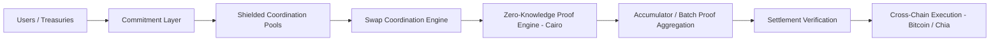

# BCYX Architecture and BCYX‑SWAP PoC

## Executive Summary  
BCYX is a **privacy-first cross-chain coordination and settlement** framework that separates *public verifiability* from *private execution*. It uses a commitment-based layer underpinned by Merkle/Accumulator trees (inspired by Accumulate) anchored to Bitcoin, together with recursive zk‑STARK proofs to validate complex swaps without revealing sensitive data. A shielded coordination pool abstracts transaction intents, while a Cairo-based ZK engine verifies batch proofs on Starknet. The BCYX‑SWAP prototype will demonstrate an atomic swap between Chia (XCH) and a Starknet asset, using on‑chain commitments, STARK proofs, and Verifiable Delay Functions (VDFs) to ensure atomicity, accountability, and selective disclosure of compliance fields.

## Architecture

BCYX’s **commitment layer** encodes swap intents and asset deposits as cryptographic commitments (e.g. Merkle roots, hashes or Accumulate receipts) anchored to Bitcoin/Chia for security. Commitments are posted on-chain without revealing details.  These feed into **shielded coordination pools**, which batch and privately match swap orders. A **Swap Coordination Engine** tracks matched swaps off-chain and orchestrates proof generation. 

The **Zero-Knowledge Proof Layer** (implemented in Cairo) generates STARK proofs attesting that swap conditions are met (e.g. both sides locked funds) without revealing identities or amounts. Proofs from many swaps are aggregated using accumulators or Merkle trees into a single batch proof. Batch proofs leverage hierarchical/recursive composition: verifying a root proof is polylogarithmic in the total work, enabling scalable throughput. 

Finally, a **Settlement Verification** step on Starknet contracts checks the batched proof and corresponding commitments. Upon success, **cross-chain execution** finalizes the swap: releasing assets on each chain atomically. Failures or disputes trigger a rollback logic (e.g. VDF timers or timeout refunds). The architecture assumes blockchain finality and sound cryptography; adversarial actions (e.g. double-spending commitments) are prevented by nullifiers and proof integrity.

### Component Responsibilities

| Component                   | Responsibility                                                                                                                                   |
|-----------------------------|--------------------------------------------------------------------------------------------------------------------------------------------------|
| **Commitment Layer**        | Encodes deposit/swap intents as Merkle/Accumulate commitments or hashes; anchors them to Bitcoin/Chia (using Taproot or Accumulate anchoring). |
| **Shielded Pools**          | Holds batched commitments, hides transaction graph; performs private order-matching and aggregation of swap intents.                              |
| **Swap Coordination Engine**| Tracks paired orders, collects proofs; triggers prover to compute zk-STARKs; manages state (including nullifiers for spent commitments).         |
| **ZK Proof Engine**         | Generates zk-STARK proofs (via Cairo/Cairo-1) attesting correctness of swap logic and commitment consistency without revealing secrets.       |
| **Accumulator**             | Aggregates multiple swap proofs/commitments into a Merkle/accumulator root; updates incrementally to support batch verification.         |
| **Verifier Contracts**      | Starknet Cairo contracts that verify STARK proofs and check committed roots; interface with on-chain records on Bitcoin/Chia for finality.          |
| **Cross-Chain Executors**   | On-chain scripts (e.g. Bitcoin Taproot or Chia CAT scripts) that lock/release funds; enforce atomic swap logic and time-lock/VDF conditions.     |

## Security, Threat Model & Privacy

-- **Security Assumptions**: Relies on the cryptographic soundness of Merkle/accumulator hashes, zk-STARK proofs, and underlying blockchains. Commitments use collision-resistant hashes; STARKs assume collision/poly-log soundness. 
- **Threat Model**: Adversary may attempt double-spend, front-run or extract private data. BCYX mitigates this by requiring valid STARK proofs before settlements and by using *nullifiers* to mark commitments as spent (preventing reuse). Malicious coordinators cannot forge state without breaking STARK integrity. 
- **Privacy & Disclosure Model**: By default, transaction details (amounts, participants) are hidden. Only high-level commitments and proofs are public. Selective-disclosure allows revealing compliance attributes (e.g. whitelisted identities) without exposing full trace. For example, a regulator can verify a KYC flag on a commitment but not see raw amounts. BCYX is “privacy-by-design” with opt-in disclosure when authorities provide proofs or keys.

## BCYX-SWAP PoC Design

### Data Structures  
- **Commitments**: Merkle-tree nodes or Accumulate account hashes representing locked UTXOs. (Each account is a growing Merkle tree.)  
- **Nullifiers**: Unique nullifiers derived from commitments (e.g. Pedersen hash of preimage) to prevent double-spend, similar to Zcash’s nullifiers.  
- **Swap Objects**: Off-chain records pairing two commitments (one from each side) along with swap metadata (IDs, timeout).  

### API Endpoints

| Endpoint               | Inputs                              | Outputs                     | Description                                 |
|------------------------|-------------------------------------|-----------------------------|---------------------------------------------|
| `POST /commit`         | `{user, asset, amount, pubkey}`     | `commitmentID`              | Create a new commitment; locks funds off-chain/AC with signature. |
| `POST /match`          | `{commitmentID_A, commitmentID_B}`  | `swapID`                    | Pair two commitments to form a candidate swap. |
| `POST /prove`          | `{swapID}`                          | `proofData`                 | Triggers zk-STARK prover to generate proof for swap. |
| `POST /verify`        | `{proofData}`                       | `success/failure`           | Calls Starknet Cairo contract to verify proof on-chain. |
| `POST /settle`        | `{swapID}`                          | `{txId_A, txId_B}`          | Finalizes atomic release of assets on both chains. |
| `POST /refund`         | `{swapID}`                          | `{refundTx}`                | Refunds assets if proof fails or timeout occurs. |

*(API is conceptual; actual implementation may use Starknet messages/events rather than HTTP.)*  

### On-Chain Contracts and Anchoring  
- **Starknet (Cairo)**: A verifier contract accepts zk-STARK proofs and commitment roots. It stores state for open swaps and nullifiers. Interfaces with off-chain proof server (via Chain Abstraction or messaging).  
- **Bitcoin/Chia Anchors**: Commitment anchors use Taproot scripts on Bitcoin (or ADI anchors on Accumulate) to cryptographically bind state【23†L1-L4】. For Chia, CAT (Chia Asset Tokens) or Chialisp can lock funds with a puzzle that requires a valid proof of commitment matching. VDFs from Chia are used for timed release/dispute.

### Proof Flow  
1. **Commit Phase**: Users lock funds in on-chain scripts, producing public commitment IDs. Each commit event is recorded (with optional Bitcoin/CAT anchoring) and yields a commitment root.  
2. **Matching & Coordination**: Two commitments (one XCH, one Starknet asset) are matched, creating a `swapID`. Off-chain, the coordinator collects the secret data (UTXO preimages) under a ZKP binding.  
3. **Proof Generation**: The Cairo prover constructs a STARK proof that “commitment A and B are locked, correspond to off-chain secret values, and satisfy swap rules”. This uses Merkle proofs of inclusion in the accumulators.  
4. **Batch Aggregation**: Multiple swaps’ proofs can be batched: we compute a Merkle/accumulator root of all proofs and generate a single aggregate proof (leveraging recursive STARKs).  
5. **Verification**: The Starknet contract verifies the aggregate proof and then verifies each swap state (using stored roots/nullifiers). Upon success, it emits a `SwapExecutable` event.  

### Accumulator Updates and Nullifiers  
- **Accumulator Algorithm**: Maintain a Merkle tree over swap commitments or proofs. Each new proof yields a leaf; tree root is updated using efficient Merkle append (or sparse Merkle). The accumulator root is included in the Starknet contract state.  
- **Nullifier Handling**: When a commitment is spent (either via successful swap or refund), compute its nullifier and store on-chain. Any attempt to reuse the same commitment fails if nullifier is already present. This prevents double spending of locked funds.

### Atomic Swap Protocol  
1. **Lock-in (t=0)**: Both parties lock XCH and Starknet token in respective on-chain scripts under BCYX-defined puzzle conditions (with timeouts and required proof conditions).  
2. **Reveal (t=1)**: Off-chain swap coordinator reveals proof triggers. If on Starknet chain, the Cairo verifier sees the pending swap and calls prover; if on Chia, it awaits STARK proof submission.  
3. **Verify & Execute**: Once proof is submitted, each chain’s contracts atomically release the counterparty’s funds (via pre-specified public keys).  
4. **Timeout/Dispute**: If the proof does not arrive by a deadline, the VDF unlocks refunds after delay (e.g. after X blocks on Chia). Both parties can individually reclaim funds post-timeout. The VDF ensures irreversible wait and mitigates front-running, as in other atomic swap protocols.

### Dispute/Rollback Logic  
- **VDF Timer**: A Chia-based VDF (or Bitcoin CLTV timelock) enforces a minimum delay before refunds. This prevents immediate counterparty theft.  
- **Fallback**: If a discrepancy is detected (e.g. proof fails), the system can trigger a rollback: invalidates the swap, and both sides can refund once VDF expires.  
- **Challenge Window**: Potentially implement a short window for dispute submission on Starknet, similar to optimistic rollup challenge, though zk proofs minimize this need.

### Testnet Deployment & Tooling  
- **Testnets**: Use Starknet testnet (e.g. Goerli/Lagos) for Cairo contracts; use Chia testnet or Signet for VDF/atomic scripts.  
- **Tooling**: Cairo compiler & tooling (Starknet docs【19†L72-L74】), Python or Rust for STARK prover (e.g. Winterfell/Cairo CLI), Chia node for VDF.  
- **Simulation Environment**: Mock chain or local devnet running Bitcoin Core regtest with Taproot support, for initial PoC.  
- **Automation**: CI scripts to run proofs and measure performance.

### Benchmarks & Metrics  
- **Proof Size**: Measure STARK proof byte-size for single swap vs batched (expect kilobytes).  
- **Verification Cost**: Gas cost of Cairo verifier for single vs batched proof.  
- **Latency**: Time to generate a proof for one swap; effect of batch size on prover time.  
- **Throughput**: Swaps per second or per batch; how many concurrent swaps before performance degrades.  
- **Security Limits**: Memory and CPU requirements for prover (to assess feasibility on modest hardware).

## Implementation Milestones (12‑Week Pilot)

| Weeks    | Milestone & Outputs                                   |
|----------|-------------------------------------------------------|
| **W1–2** | **Design & Setup:** Finalize architecture; define data schemas and contracts; setup dev environments (Starknet, Chia). Document design with diagrams. |
| **W3–4** | **Commitment Layer:** Implement on-chain commitment contracts (Cairo); scripting for Bitcoin/Chia anchors. Develop accumulator structure and nullifier logic. |
| **W5–6** | **ZK Proof Engine:** Prototype Cairo program for swap logic; integrate with STARK prover (Winterfell or Cairo off-chain). Initial single-swap proof generation and local verify. |
| **W7–8** | **Batch & Recursion:** Implement batched Merkle accumulator; support multiple swap proofs. Test recursive proof composition (multiple swaps into one proof)【20†L52-L60】. |
| **W9–10**| **Integration & Testing:** Deploy verifier on Starknet testnet; complete end-to-end XCH↔Starknet swap flow. Conduct atomic swap tests, handle timeout logic. |
| **W11**  | **Benchmarking & Documentation:** Measure proof sizes, costs, latencies; optimize code. Finalize developer docs and API references. |
| **W12**  | **Demo & Handoff:** Public demonstration of confidential swap; publish code (MIT license) and technical write-up. Update repository with tutorials and benchmarks. |

## Tables

**Component Responsibilities (ref. above)**

| Component           | Roles                                                 |
|---------------------|-------------------------------------------------------|
| Commitment Layer    | Users lock funds; anchor commitments to blockchain    |
| Shielded Pools      | Match and batch swaps privately                       |
| Swap Engine         | Manage swap state; collect inputs for proofs          |
| ZK Prover           | Generate STARK proofs of swap correctness             |
| Accumulator         | Aggregate proof commitments into single root         |
| Verifier Contract   | Verify proofs; enforce swap outcomes                  |
| Executors (BTC/XCH) | Release or refund assets based on proof outcomes     |

**BCYX-SWAP API Endpoints (conceptual)**

| Endpoint      | Inputs                    | Output               | Purpose                         |
|---------------|---------------------------|----------------------|---------------------------------|
| `/commit`     | user, asset, amount, key  | commitmentID         | Lock assets, return commitment  |
| `/match`      | commitmentID_A, B         | swapID               | Create swap pair                |
| `/prove`      | swapID                    | proofBlob            | Compute zk-STARK proof          |
| `/verify`    | proofBlob, proofRoot       | success/fail         | On-chain proof verification     |
| `/settle`     | swapID                    | txIDs                | Trigger atomic release          |
| `/refund`     | swapID                    | refundTx             | Refund assets on timeout        |

**Milestone Schedule**

| Week Range | Goals & Deliverables                                      |
|------------|------------------------------------------------------------|
| 1–2        | Architecture docs; dev environment; basic contracts       |
| 3–4        | Commitment & anchoring layer implemented; nullifiers     |
| 5–6        | Cairo ZK programs; single-swap proof prototype           |
| 7–8        | Batch/recursive proof integration; multi-swap tests       |
| 9–10       | Starknet deployment; end-to-end atomic swap tests         |
| 11         | Performance benchmarks; documentation draft              |
| 12         | Final demo; public release of code and report            |

## Appendix: References

- Accumulate Network — *How Accumulate Enables Modular Blockchains* (Merklization, anchoring)  
- ShiftMag — *Cairo and Starknet: Why they exist* (Cairo as provable language)  
- Starknet Forum — *Proofs in the Protocol* (STARK/recursion fundamentals)  
- Ben-Sasson *et al.* (2018), *Scalable, transparent, and post-quantum secure computational integrity* (zk-STARK basis)  
- StarkWare (2024), *The Cairo Programming Language Book* (Cairo specifics)  
- Lerner *et al.* (2024), *BitVMX: A CPU for Bitcoin* (context on Bitcoin anchoring)  
- Chia Network (2024), *Chia Whitepaper* (VDF and CAT concepts)  

These sources inform BCYX’s design: Merkle trees and Accumulate’s hierarchical anchoring; Cairo/STARK provability; and atomic swap primitives with timelocks/VDFs.
