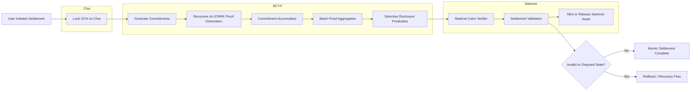

# Developer Proposal: BCYX Pilot on Starknet

## Privacy-First Cross-Chain Coordination Infrastructure for Bitcoin-Family Assets

**Submitted to:** [Starknet Foundation Seed Grants Program](https://www.starknet.io/foundation/?utm_source=chatgpt.com)
**Submission Date:** May 12, 2026
**Project Lead:** Annabelle Shalom ([@annabelleshalom](https://github.com/SatoshiShalom) / ShalomXEdge)
**Co-Contributors:** [@Paulsnx2](https://www.linkedin.com/in/paulsn/) (Cairo & zkVM), [@fabohax](https://github.com/fabohax) (Bridge & Testing)
**Repository:** [BCYX Repository](https://github.com/bcyx-protocol/docs)
**Grant Request:** $25,000 USD equivalent in STRK for a 12-week MVP pilot

---

# Executive Summary

BCYX is a privacy-first cross-chain coordination and settlement protocol leveraging recursive STARK proofs, Taproot-compatible commitments, selective-disclosure primitives, and accumulator-based verification systems.

This proposal adapts the current BCYX research stack into a Starknet-native proof-of-concept focused on:

* confidential cross-chain settlement,
* atomic coordination,
* recursive proof aggregation,
* and programmable selective disclosure for Bitcoin-family assets.

The MVP demonstrates a confidential swap coordination mechanism between external chains (initially Chia XCH) and Starknet-based assets such as STRK and strkBTC-style representations.

Rather than functioning as a conventional bridge, BCYX acts as a:

* modular coordination layer,
* proof aggregation engine,
* and privacy-preserving settlement fabric.

The system enables:

* cryptographic verification of settlement conditions,
* bounded compliance predicates,
* and constrained attestation visibility

while preserving:

* ownership privacy,
* transaction confidentiality,
* routing abstraction,
* and execution secrecy.

The pilot emphasizes:

* reusable Cairo infrastructure,
* recursive proof interoperability,
* commitment accumulators,
* batched verification flows,
* and selective-disclosure settlement logic.

BCYX already includes:

* recursive proof experimentation,
* Cairo-based research,
* Taproot anchoring experiments,
* proof aggregation prototypes,
* and interoperability research involving Bitcoin-family systems.

This 12-week pilot focuses on delivering:

* Starknet-native prototype contracts,
* confidential swap coordination flows,
* proof aggregation infrastructure,
* developer tooling,
* and open technical documentation

aligned with Starknet’s evolving privacy and BTCFi ecosystem.

---

# 1. Problem Statement & Ecosystem Opportunity

Current interoperability systems force difficult tradeoffs between:

* transparency,
* privacy,
* settlement guarantees,
* and compliance interoperability.

Existing approaches typically fall into three categories:

* Transparent systems exposing transaction relationships and treasury activity.
* Custodial bridge systems introducing intermediary trust assumptions.
* Opaque privacy systems lacking interoperability and compliance flexibility.

Bitcoin-family ecosystems and Starknet currently lack generalized selective-disclosure coordination primitives capable of supporting:

* privacy-preserving settlement,
* atomic cross-chain coordination,
* recursive proof verification,
* and bounded compliance attestations.

BCYX introduces a Starknet-native approach using:

* recursive zk-STARK verification,
* hierarchical proof aggregation,
* commitment accumulators,
* shielded coordination pools,
* and selective-disclosure settlement logic.

The pilot contributes reusable infrastructure applicable to:

* BTCFi experimentation,
* cross-chain settlement research,
* selective-disclosure middleware,
* confidential interoperability,
* oracle coordination,
* and proof aggregation systems.

BCYX is positioned as reusable infrastructure research rather than a standalone bridge product.

---

# 2. Technical Architecture & Pilot Scope

## Existing BCYX Components

Current research and development work includes:

* experimental Cairo coordination contracts,
* recursive proof aggregation research,
* Taproot-compatible anchoring experimentation,
* commitment accumulator prototypes,
* selective-disclosure proof systems,
* and interoperability experiments involving Bitcoin-family systems.

---

## Pilot Deliverables (12 Weeks)

The proposed pilot includes:

* Starknet-native Cairo contracts for confidential settlement coordination.
* Commitment accumulator and batch proof aggregation modules.
* Chia settlement adaptor prototype connected to Starknet verification flows.
* Demonstration settlement flow: XCH ↔ Starknet asset prototype.
* Recursive proof verification experiments on Starknet testnet.
* Public developer documentation and integration notes.
* Lightweight explorer/dashboard for proof visualization and selective disclosure states.
* Open MIT-licensed repository updates and reusable Cairo modules.

---

## Illustrative Settlement Flow

1. A participant locks XCH into a settlement condition on Chia.
2. A BCYX coordination layer generates commitment representations of the settlement intent.
3. Recursive zk-STARK proofs validate settlement predicates privately.
4. Commitment accumulators aggregate batched execution states.
5. Starknet Cairo verifier contracts validate recursive proof commitments.
6. Settlement completes atomically once verification conditions are satisfied.
7. Invalid or disputed states trigger rollback or delayed recovery conditions.

The pilot focuses on:

* proof aggregation,
* confidential coordination,
* recursive verification,
* and cross-chain synchronization mechanics,

rather than production deployment readiness.

---

# 3. Why Starknet

Starknet provides a strong engineering environment for recursive proof systems and privacy-oriented interoperability because of:

* Cairo-native verification flows,
* STARK-based computation alignment,
* efficient recursive verification,
* and account abstraction compatibility.

This pilot aligns with multiple Starknet ecosystem priorities:

* Recursive proof composition.
* BTCFi-oriented interoperability infrastructure.
* Privacy-preserving settlement primitives.
* Efficient verifier execution environments.
* Cross-chain experimentation involving Bitcoin-family assets.

BCYX contributes:

* reusable Cairo tooling,
* recursive verification patterns,
* commitment accumulator systems,
* selective-disclosure primitives,
* interoperability references,
* and educational documentation

to the broader Starknet ecosystem.

---

# 4. Team & Execution Plan

| Role                      | Member           | Responsibilities                                       |
| ------------------------- | ---------------- | ------------------------------------------------------ |
| Lead Architect & Research | Annabelle Shalom | Proof architecture, coordination logic, documentation  |
| Cairo & zkVM Integration  | @Paulsnx2        | Cairo contracts, recursive verification, testing       |
| Bridge & Test Engineering | @fabohax         | Chia adaptor, interoperability flows, explorer tooling |

---

## Development Cadence

* Twice-weekly engineering syncs.
* Bi-weekly public development updates.
* Open-source repository commits throughout the pilot lifecycle.
* Transparent benchmark publication and documentation updates.

---

## Milestones

### Week 4

* Cairo settlement contracts operational locally.
* Initial recursive proof verification experiments.
* Commitment accumulator prototype.

### Week 8

* Chia adaptor connected to Starknet verification flow.
* Selective-disclosure settlement experiments on testnet.
* Batch proof aggregation experiments.

### Week 12

* End-to-end confidential settlement prototype demonstration.
* Public technical documentation release.
* Explorer/dashboard prototype.
* Benchmark publication and final technical report.

---

# 5. Lean Budget & Funding Request

| Category                    | Amount (USD equivalent) | Notes                                              |
| --------------------------- | ----------------------- | -------------------------------------------------- |
| Contributor Support         | $19,000                 | Engineering, research, testing, documentation      |
| Infrastructure & Compute    | $3,000                  | Prover compute, Starknet testnet usage, Chia nodes |
| Security Review             | $2,000                  | Review of proof and settlement logic               |
| Hosting & Operational Costs | $1,000                  | Explorer hosting, CI/CD, tooling                   |
| **Total Requested**         | **$25,000**             | Seed Grant request                                 |

The contributing team will provide additional independent research and development effort beyond the requested grant budget to complete the proposed pilot timeline.

The proposal intentionally focuses on:

* reusable infrastructure outputs,
* open technical documentation,
* and public ecosystem contributions.

---

# 6. Risks, Mitigations & FAQ

## Q: What is the current maturity of BCYX?

BCYX currently includes:

* recursive proof research,
* Cairo experimentation,
* Taproot anchoring exploration,
* interoperability prototypes,
* and commitment accumulator experimentation.

The Starknet pilot expands these into a focused proof-of-concept implementation.

---

## Q: How does this differ from existing bridge tooling?

BCYX focuses specifically on:

* confidential settlement coordination,
* recursive proof interoperability,
* commitment accumulators,
* selective disclosure,
* and proof aggregation infrastructure.

The pilot is intended as complementary infrastructure research rather than a competing bridge product.

---

## Q: Why recursive proofs and accumulators?

Recursive proof aggregation enables:

* compact verification,
* scalable settlement synchronization,
* and compressed execution proofs.

Commitment accumulators reduce:

* verification overhead,
* synchronization complexity,
* and settlement costs.

---

## Q: Intellectual Property & Licensing

All MVP deliverables produced during the pilot will be released under the MIT License.

The repository will include:

* reusable Cairo modules,
* proof orchestration patterns,
* integration examples,
* and technical documentation

intended to support experimentation across Starknet and Bitcoin-oriented ecosystems.

---

## Q: Technical dependencies or risks?

Potential engineering challenges include:

* recursive proof optimization,
* proving-performance constraints,
* interoperability edge cases,
* and cross-chain synchronization complexity.

These findings and limitations will be documented transparently throughout development.

---

## Q: Success Metrics

1. Demonstration of a functional confidential settlement prototype.
2. Successful recursive proof verification within Starknet execution constraints.
3. Public release of reusable Cairo components and documentation.
4. Developer engagement through repository activity and technical discussion.
5. Benchmarks documenting proof aggregation efficiency and verifier costs.

---

## Q: Post-pilot sustainability?

The pilot establishes a reusable research and infrastructure foundation for:

* future interoperability experiments,
* ecosystem integrations,
* and expanded settlement coordination systems.

Future development may proceed through:

* ecosystem collaboration,
* additional grants,
* independent research funding,
* or community-driven contributions.

---

# 7. Architecture Diagram

---

# 8. Public Goods Contribution

The pilot contributes reusable infrastructure to the Starknet ecosystem, including:

* Cairo settlement verifier examples,
* recursive proof orchestration patterns,
* commitment accumulator primitives,
* selective-disclosure coordination systems,
* interoperability references,
* public documentation,
* and benchmark-oriented research outputs.

All deliverables generated through the grant-funded MVP will remain publicly accessible under the MIT License.

---

# 9. Call to Action & Next Steps

We are prepared to submit formally through the [Starknet Foundation Seed Grants Portal](https://www.starknet.io/foundation/) and complete onboarding requirements immediately.

We welcome the opportunity for a short technical discussion with the Starknet engineering and grants teams to review:

* recursive proof assumptions,
* interoperability design choices,
* accumulator architecture,
* and public infrastructure objectives.

This pilot aims to contribute reusable privacy-first coordination infrastructure for Starknet’s evolving BTCFi and interoperability ecosystem.

**Primary Contact:** [annabelle@shalomxedge.org](mailto:annabelle@shalomxedge.org) | @annabelleshalom
**Repository:** [BCYX GitHub Repository](https://github.com/bcyx-protocol/docs)

---

**Signed,**

**Annabelle Shalom**
with @Paulsnx2 & @fabohax
BCYX / ShalomXEdge Core Team
