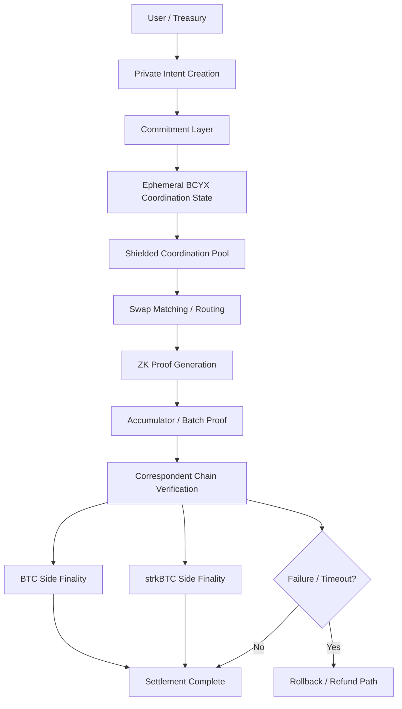

# BCYX Settlement Model

> Ephemeral coordination, correspondent-chain settlement, and proof-based finalization.

---

## Overview

BCYX uses an **ephemeral settlement model**: the BCYX coordination layer exists only while a swap or settlement is in flight. It does not try to become a permanent balance sheet, custody layer, or long-lived liquidity pool. Instead, BCYX coordinates private intent, validates it with commitments and zero-knowledge proofs, and then lets the **correspondent chains** carry the final settlement state.

This is consistent with the paper’s two-layer pattern: a committed data layer with anchored receipts, plus a zero-knowledge layer that proves predicates over the committed state without exposing values. The same design also emphasizes batch efficiency, Bitcoin anchoring, authority provenance, and selective disclosure.

In practice, BCYX should be thought of as a **transient settlement fabric**:
- it receives an intent,
- matches or routes it,
- proves it,
- and then disappears once settlement is complete.

The persistent truth lives on the correspondent chains, not in BCYX itself.

---

## Core Idea

A BCYX settlement is successful only when the relevant correspondent chains have reached a compatible final state.

BCYX does **not** replace settlement on the chains themselves. It only coordinates the path to settlement.

That means:
- BCYX can help a BTC ↔ strkBTC swap happen privately,
- but the final asset state must still be recognized by the correspondent chains,
- and the swap should be recoverable if one side fails.

---

## What “Ephemeral” Means

Ephemeral means BCYX maintains only temporary coordination state:

- pending swap intent
- commitment root
- nullifier state
- proof batch
- timeout / expiry state
- finalization receipt

Once the swap is finalized or refunded:
- the coordination object is no longer needed,
- only the chain-native final state remains.

This gives BCYX three advantages:
- lower long-term state bloat,
- simpler security boundaries,
- easier cleanup and recovery.

---

## Settlement Principle

BCYX follows this rule:

```text
If the correspondent chains have not settled,
BCYX has not settled.
````

So the protocol does not claim finality on its own. It only coordinates and proves that the corresponding chain states are consistent with the intended swap.

---

## Architecture



---

## Roles in the Model

### 1. User / Treasury

Creates the swap or settlement intent.

### 2. Commitment Layer

Turns the intent into a private commitment that can be proven later.

### 3. Ephemeral BCYX Coordination State

Holds only the temporary metadata required to coordinate the swap.

### 4. Shielded Coordination Pool

Matches or routes intents without publicly revealing the coordination graph.

### 5. Proof Layer

Generates zero-knowledge proofs for correctness and eligibility.

### 6. Correspondent Chains

Hold the actual final settlement state.

### 7. Verifier

Checks that the proof and chain state match the expected settlement outcome.

---

## Correspondent Chains

A **correspondent chain** is a chain that participates directly in settlement finality.

For BCYX-SWAP, the correspondent chains could be:

* Bitcoin for BTC locking or release,
* Starknet for strkBTC minting, redemption, or verification,
* another UTXO chain,
* or a settlement chain that mirrors the final state.

The key property is that settlement is not “inside BCYX”; BCYX only ensures the correspondent chains can settle consistently.

---

## Settlement Lifecycle

### Phase 1 — Intent Creation

The user defines:

* asset in,
* asset out,
* target chain,
* timeout,
* disclosure policy,
* and optional compliance predicates.

A commitment is created from that data.

### Phase 2 — Ephemeral Coordination

BCYX accepts the intent and places it into a short-lived coordination pool.

The pool may:

* match a counterparty,
* match a pool rule,
* or route the swap into a batch.

### Phase 3 — Proof Generation

BCYX generates ZK proofs that the hidden state satisfies the swap rules.

### Phase 4 — Batch Aggregation

If multiple swaps are pending, they are compressed into a batch proof.

### Phase 5 — Correspondent-Chain Settlement

The correspondent chains execute the final state transition:

* BTC remains locked, released, or re-assigned,
* strkBTC is released or burned,
* or a mirrored settlement record is written.

### Phase 6 — Finalization or Recovery

If everything matches, settlement is final.
If not, the protocol falls back to timeout or refund behavior.

---

## State Model

BCYX should keep the state surface as small as possible.

### Persistent State

* verified commitment roots
* nullifier roots
* final settlement receipts
* proofs of completion
* correspondence markers on target chains

### Ephemeral State

* pending order intent
* routing candidates
* batch membership queue
* temporary matching state
* pre-finalization coordination metadata

### Invalidated State

* expired swaps
* rejected proofs
* stale routes
* already-spent commitments

---

## Atomicity

BCYX aims for **ephemeral atomicity**:

* either the correspondent chains settle in a way that matches the proof,
* or the settlement is not considered complete.

This is weaker than “everything happens inside one chain,” but stronger for cross-chain coordination because it allows:

* private preparation,
* proof-backed execution,
* and safe timeout cleanup.

---

## Rollback / Recovery

Because the coordination layer is ephemeral, rollback should be simple.

If the swap fails:

* the commitment remains unspent,
* the nullifier is not finalized,
* the batch proof is rejected,
* and the correspondent-chain refund path becomes available.

Recovery should rely on:

* timeouts,
* challenge windows,
* or timeout-based unlocks on the correspondent chains.

---

## Why This Model Fits BCYX

This model aligns with the broader BCYX architecture:

* private coordination,
* public verification,
* accumulator-based batching,
* selective disclosure,
* and proof-native settlement.

It also avoids a common trap: becoming a permanent bridge or a custodial routing layer.

BCYX should be a **temporary settlement coordinator**, not a standing custody system.

---

## Security Properties

### 1. No long-lived BCYX custody

BCYX should not hold assets as a permanent state.

### 2. Proof-driven finality

Settlement validity comes from proofs plus correspondent-chain execution.

### 3. Replay resistance

Nullifiers prevent the same settlement object from being spent twice.

### 4. Privacy by default

Only the minimum state needed for settlement should be visible.

### 5. Recovery safety

Timeout or refund logic should remain available if the correspondent chains fail to align.

The paper’s architecture supports this general approach through anchored receipts, hierarchical proof structure, and zero-knowledge selective disclosure. 

---

## BCYX-SWAP Implication

For the proof-of-concept, this model means:

* BTC is the source asset,
* strkBTC is the correspondent settlement representation,
* BCYX coordinates the swap privately,
* the proof verifies the intended path,
* the correspondent chains finalize the value transfer,
* and BCYX state expires once the transaction completes.

So the PoC can be implemented as:

* a short-lived swap session,
* with commitment tracking,
* proof generation,
* verifier checks,
* and chain-native finalization.

---

## Minimal PoC Flow

1. User submits BTC swap intent.
2. BCYX creates a commitment.
3. Coordination pool matches or routes the intent.
4. Proof is generated and aggregated.
5. Starknet verifier confirms the proof.
6. BTC-side and strkBTC-side settlement finalize.
7. BCYX ephemeral state is discarded.

---

## Future Extensions

This model can later expand to:

* private treasury routing,
* multi-party correspondent settlement,
* oracle-backed settlement conditions,
* privacy-preserving RWA coordination,
* and cross-chain batch settlement.

But the first implementation should stay narrow:
**ephemeral coordination, correspondent-chain finality, no long-lived custody.**

---

## Summary

BCYX settlement should be ephemeral by design.

The protocol coordinates private intent, proves correctness, and then lets the correspondent chains carry final settlement. That keeps BCYX:

* lightweight,
* private,
* auditable,
* and easier to reason about.

