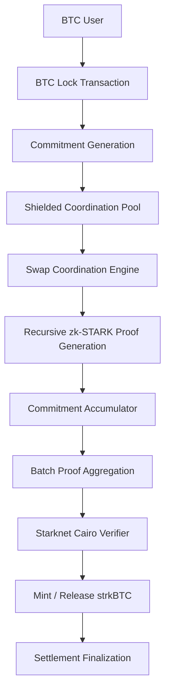

# BCYX-SWAP

> Proof-of-Concept confidential swap coordination mechanism for BTC ↔ strkBTC settlement.

---

# Overview

BCYX-SWAP is the initial proof-of-concept implementation of the BCYX coordination architecture.

The objective is to demonstrate:
- confidential cross-chain swap coordination,
- atomic settlement execution,
- selective disclosure,
- and aggregated proof verification

between:
- Bitcoin-family assets (BTC),
- and Starknet-based representations (strkBTC).

The system is not designed as a traditional bridge.

Instead, BCYX-SWAP acts as:
- a privacy-first coordination layer,
- using commitments,
- recursive zk-STARK proofs,
- shielded coordination pools,
- and accumulator-based settlement verification.

---

# Core Thesis

Traditional bridge systems expose:
- counterparties,
- routing paths,
- settlement relationships,
- treasury movements,
- and execution graphs.

BCYX-SWAP attempts to separate:
- public verification,
from:
- private coordination.

```txt
Public verification.
Private coordination.
```

---

# High-Level Architecture



---

# System Components

## 1. BTC Settlement Layer

The Bitcoin layer acts as:
- the source settlement domain,
- collateral environment,
- and anchoring layer.

BTC is locked into predefined settlement conditions controlled by:
- commitments,
- time constraints,
- and proof verification requirements.

The initial PoC may use:
- Taproot-compatible scripts,
- multisig escrow assumptions,
- or experimental covenant-like coordination logic.

---

## 2. Commitment Layer

BCYX abstracts swap intents into cryptographic commitments.

Commitments may encode:
- asset amount,
- destination chain,
- recipient conditions,
- disclosure permissions,
- settlement deadlines,
- and execution predicates.

Instead of publicly exposing swap metadata, only commitment hashes become visible.

Example:

```txt
Commitment = Hash(
    amount,
    recipient,
    destination,
    nonce,
    conditions
)
```

---

# 3. Shielded Coordination Pools

Swap intents enter shielded coordination pools.

These pools provide:
- private swap matching,
- hidden counterparty relationships,
- confidential routing,
- and batched execution coordination.

The pools function similarly to:
- private execution environments,
- or shielded settlement queues.

Inside the pool:
- commitments remain hidden,
- counterparties remain abstracted,
- and execution graphs remain confidential.

---

# 4. Swap Coordination Engine

The coordination engine manages:
- swap lifecycle synchronization,
- settlement ordering,
- proof generation triggers,
- rollback conditions,
- and batch aggregation.

The engine does NOT require public visibility into:
- wallet balances,
- transaction relationships,
- or routing paths.

Instead:
- proof validity becomes the coordination primitive.

---

# 5. Recursive zk-STARK Proof Layer

BCYX-SWAP uses recursive zk-STARK proofs to validate:
- commitment correctness,
- settlement integrity,
- nullifier validity,
- execution consistency,
- and selective disclosure predicates.

The proofs verify:
- valid execution occurred,
without revealing:
- internal coordination state,
- ownership,
- balances,
- or execution relationships.

---

# 6. Commitment Accumulators

The protocol aggregates commitments into accumulator structures.

Accumulators compress:
- swap states,
- execution proofs,
- nullifiers,
- and settlement commitments

into:
- minimal verification roots.

Example:

```txt
Swap1
Swap2
Swap3
Swap4
   ↓
Accumulator Root
   ↓
Single Aggregated Verification Proof
```

This dramatically reduces:
- on-chain verification overhead,
- synchronization complexity,
- and settlement costs.

---

# 7. Starknet Cairo Verifier

A Starknet Cairo verifier contract validates:
- recursive proof commitments,
- accumulator roots,
- settlement predicates,
- and disclosure conditions.

The verifier acts as:
- the settlement confirmation layer for strkBTC issuance or release.

---

# Atomic Coordination Lifecycle

## Phase 1 — Swap Intent Creation

The user:
- initiates BTC settlement,
- defines swap conditions,
- and generates commitments.

Example:
- BTC amount,
- target strkBTC amount,
- settlement timeout,
- disclosure rules.

---

## Phase 2 — BTC Locking

BTC enters:
- a Taproot-compatible settlement condition,
- or PoC escrow mechanism.

The settlement state becomes linked to:
- a commitment identifier.

---

## Phase 3 — Shielded Coordination

The swap enters:
- a shielded coordination pool.

The protocol privately coordinates:
- counterparty matching,
- execution sequencing,
- and settlement synchronization.

---

## Phase 4 — Proof Generation

Recursive zk-STARK proofs validate:
- settlement correctness,
- commitment validity,
- and execution constraints.

Proofs become recursively aggregated.

---

## Phase 5 — Batch Aggregation

Multiple swap executions compress into:
- aggregated accumulator roots,
- and minimal settlement proofs.

---

## Phase 6 — Starknet Verification

The Cairo verifier contract validates:
- aggregated proofs,
- settlement conditions,
- and accumulator consistency.

Once validated:
- strkBTC is minted or released.

---

## Phase 7 — Settlement Finalization

The swap finalizes atomically.

Either:
- all verification conditions succeed,
or:
- rollback/recovery logic triggers safely.

---

# Selective Disclosure

BCYX-SWAP supports bounded selective disclosure.

Users may prove:
- compliance predicates,
- timing conditions,
- ownership attestations,
- or settlement authorization

without exposing:
- full transaction history,
- counterparties,
- or internal coordination state.

Example:

```txt
"Prove this swap satisfies policy X
without revealing the user identity."
```

---

# Rollback & Recovery Logic

The PoC includes:
- settlement timeout conditions,
- invalid proof detection,
- and rollback/recovery paths.

Potential recovery models include:
- delayed settlement windows,
- dispute periods,
- or VDF-based rollback coordination.

---

# Security Assumptions

BCYX-SWAP inherits security assumptions from:
- Bitcoin settlement guarantees,
- STARK proof soundness,
- collision-resistant hashing,
- Merkle tree integrity,
- and recursive proof correctness.

The PoC intentionally minimizes:
- trusted relayers,
- custodial coordination,
- and transparent execution assumptions.

---

# Why This Architecture Matters

BCYX-SWAP explores a different interoperability philosophy.

Traditional bridges coordinate through:
- visible execution,
- relayers,
- or liquidity transport.

BCYX coordinates through:
- proofs,
- commitments,
- and private synchronization.

The protocol attempts to answer:

```txt
Can cross-chain capital coordination remain private
while settlement integrity remains publicly verifiable?
```

---

# Future Extensions

The BCYX architecture may later expand toward:
- confidential BTCFi,
- private treasury coordination,
- institutional settlement systems,
- oracle coordination,
- proof markets,
- selective-disclosure RWAs,
- and generalized cross-chain coordination infrastructure.

---

# Status

Research / Experimental PoC

BCYX-SWAP is currently a proof-of-concept architecture focused on:
- confidential swap coordination,
- recursive proof aggregation,
- and privacy-preserving settlement synchronization.

The implementation is not production-ready.
