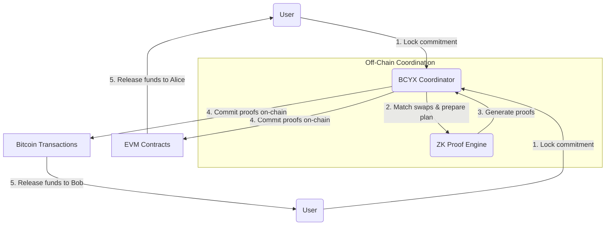

# BCYX Pilot — Technical Summary & Swap PoC Design

**Executive Summary.** BCYX is a Bitcoin-oriented privacy-first coordination layer enabling **confidential cross-chain swaps and settlement**. It uses cryptographic commitments, Zero-Knowledge proofs, and batched verification to decouple *public verifiability* from *private execution*. Instead of exposing raw transaction graphs or counterparties, BCYX abstracts swap intents via commitment trees and nullifiers. An aggregator combines many swap operations into succinct proofs (e.g. via recursive SNARK/STARK or batching) to minimize on-chain overhead. The pilot focuses on a private atomic swap use case, validating that two parties can exchange assets across chains (e.g. BTC ⇄ ERC-20) **atomically**, preserving privacy and security. We describe goals, threat model, protocol flows, proof schemes, cost trade-offs, and a PoC design with sequence/flow diagrams. Key references include recent ZK accumulator research【1†L60-L69】【2†L77-L81】, recursive proof techniques【4†L119-L124】【6†L199-L201】, and anchoring on Bitcoin/EVM【13†L29-L36】【14†L105-L112】. We also compare three implementation variants (lightweight, balanced, heavy) in terms of latency, cost, privacy, and complexity. An implementation checklist with timeline and team roles is provided for the grant proposal.

---

## Goals

- **Private Atomic Swaps:** Enable two parties (or DAOs) to swap assets across chains without revealing amounts or identities, ensuring *all-or-nothing* settlement or safe abort (atomicity)【8†L71-L80】【9†L163-L172】.  
- **Selective Disclosure:** Allow optional transparency (e.g. regulatory audit) via committed proofs, but default to privacy (no extra data leaked).  
- **Proof Aggregation:** Batch many swaps into aggregated ZK proofs to reduce on-chain work【6†L199-L201】【22†L584-L587】.  
- **Bitcoin Anchoring:** Anchor final swap state/checkpoints to Bitcoin (and optionally EVM) for immutable settlement guarantees【13†L29-L36】【14†L105-L112】.  
- **Modular Coordination:** Provide a general coordination layer (not just a two-party bridge) that can extend to multi-party swaps, treasury routing, or oracle verification in future.

---

## Threat Model & Security Assumptions

- **Adversaries:** Parties may try to abort swaps, reveal information, or insert fraudulent proofs. We assume:
  - At least one honest participant (or external observer) in each swap. 
  - No coalition can forge a zero-knowledge proof or break the commitment scheme without breaking underlying crypto assumptions.  
  - Off-chain network can be adversarial (mitigated by cryptographic guarantees, not trust in relayers).  

- **Safety and Liveness:** BCYX enforces **safety** (no fake settlement: a proof is needed for any on-chain credit【11†L198-L207】) and **liveness** (if both parties cooperate and finalization conditions are met, funds are swapped). The protocol aborts safely on timeouts.  

- **Privacy:** The protocol leaks only what proofs reveal: final spend validity but not paths or amounts. We assume ZK-proof soundness: no information beyond validity is exposed【1†L62-L71】【2†L77-L81】.  
- **Cryptographic Assumptions:** Standard discrete-log (for elliptic accumulators), pairing security (if SNARKs used), and hash collision resistance (for commitments and nullifiers). Use transparent setups (e.g. PLONK/Halo or zkSTARK) if possible to avoid trusted setup【2†L68-L76】.

---

## System Architecture



1. **Commitment Layer:** Alice and Bob each submit a **cryptographic commitment** of their swap intent to BCYX. A commitment (e.g. a Pedersen hash) encodes `(user_pubkey, asset, amount, randomness)`, hiding details. Corresponding **nullifiers** (hashes of the commitment plus user secret) prevent double-use without revealing identity. Only commitments (not plaintext amounts or addresses) are ever published.  
2. **Shielded Coordination Pools:** BCYX collects and matches swap intents in a private pool. It organizes paired commitments for atomic exchange while keeping user details hidden. The pool enforces *private matching*: only paired intents proceed.  
3. **Swap Coordination Engine:** Once a match is found, the engine locks the intents and triggers proof generation. It enforces that both sides have valid commitments and required assets (via off-chain checks or deposit proofs). It also handles timeouts/retries: if one party fails to cooperate, commitments can be safely refunded after a timeout.  
4. **Zero-Knowledge Layer:** BCYX generates ZK proofs attesting to correct execution: that the commitments are spent atomically according to agreed rules (e.g. same secret or common condition). We use a *succinct ZKP* system (e.g. Groth16, PLONK, Halo) to prove “I know valid openings for commitment A and commitment B that satisfy the swap logic” without revealing them. For scalability, proofs are **aggregated** via recursive or batching schemes, so that many swaps produce one proof.  
5. **Accumulator & Batch Aggregation:** BCYX maintains an **accumulator** (e.g. a Merkle root or RSA/Curve-tree structure【1†L62-L71】【2†L77-L81】) for commitments. Each swap adds/removes elements to this accumulator. Periodically, the accumulator’s root and an aggregated ZK proof covering a batch of swaps are published on-chain. This *batch proof* compactly verifies hundreds of swaps at once【22†L584-L587】【23†L57-L63】.  
6. **Settlement Anchoring:** The final (batched) swap results are committed into both Bitcoin and an EVM chain. For Bitcoin, BCYX may use a multi-signature or a Taproot script to lock/unlock BTC (similar to Taproot-based swaps【20†L363-L372】). For EVM, a smart contract verifies the ZK proof and releases tokens. Periodic anchoring of BCYX’s state (e.g. accumulator root) to the Bitcoin blockchain provides an immutable audit trail【13†L29-L36】【14†L105-L112】.

---

## Data Flows & Message Formats

- **Swap Intent:** Each party prepares an intent message:
  ```
  {
    “commitment”: C = Hash(user_pub, asset, amount, random), 
    “nullifier”: N = Hash(C, user_priv), 
    “asset_id”: (e.g. BTC, USDC),
    “amount_public”?: optional public amount field,
    “timeout”: block_timestamp,
    “proof_of_reserve”?: (optional ZK proof that user controls asset)
  }
  ```
  The commitment `C` hides (user, amount). The nullifier `N` is kept secret until spending. Inflows/outflows are matched by BCYX.

- **Coordination Messages:** 
  - **Match Event:** `{"match_id", "commitA", "commitB"}` pairs two commitments.
  - **Execution Plan:** Contains the agreed conditions (e.g. which chain each asset is locked on, swap rates, cryptographic condition ID). This is internal to BCYX (not public).

- **ZK Proof:** BCYX generates a proof object `π` that attests: *“I know openings of commits C_A and C_B satisfying the swap condition (e.g. C_A has secret s and C_B has the same s)”*. The proof’s public inputs include an *aggregated accumulator root* and perhaps a batch ID. Format depends on proof system (Groth16: A,B,C ∈ G1/G2; PLONK: commitment bytes; etc).

- **Anchor Transactions:** On-chain, the BCYX contract/transaction expects:
  - Batch update: new accumulator root (or Merkle root), proof `π`, and list of public outputs (merkle root, nullifiers of spent, etc).
  - Signature or transaction from BCYX federators (if multi-signature approach is used).
  
- **Settlement Transactions:** Once proof is verified, the contract unlocks assets. For example:
  ``` 
  if verify(π, old_root, new_root, …) then
    for each nullifier N in batch:
      burn corresponding commitment (prevent reuse)
    for each payout (Alice_addr, amount), (Bob_addr, amount):
      transfer assets accordingly
  ```

All messages and proofs use standard encodings (bytes, Ethereum contract ABI, Bitcoin script OP_RETURN for anchors). 

---

## Commitments & Nullifiers

BCYX uses a **UTXO-style commitment scheme**. A commitment `C = Com(user_pub, asset, amount, r)` binds the swap details. On spend, a **nullifier** `N = Com(user_priv, C)` is revealed. This approach (inspired by Zcash/Sapling) ensures:
- **Privacy:** `C` hides user and amount; no leakage until proof reveals minimal info (typically none). 
- **Unlinkability:** Without the secret, one cannot link a public proof to a specific user.
- **Double-Spend Prevention:** Once `N` is published, the corresponding `C` cannot be reused in another proof. 

For implementation, we might use a hash-based commitment (e.g. Poseidon or SHA-based on R1CS-friendly curve for SNARK efficiency【20†L363-L372】). Nullifier generation can use a keyed hash (e.g. Hash(C||sk)). The exact scheme is an open design choice:
- **Pedersen/ElGamal** (with discrete-log): efficient for SNARK, but requires trust in group generator.
- **Hash-based (Merkle)**: use Merkle trees of commitments and prove membership.
- **Transparent Accumulators (Curve Tree【2†L68-L77】)**: combine elliptic and Merkle for trustless setup.

Trade-offs:
- **Merkle Tree:** Simple but proofs scale with tree depth; cheaper to implement but larger ZK circuits.
- **RSA Accumulator:** Constant-size membership proofs, but requires setup or stronger assumptions.
- **Transparent Tree (Curve Tree):** Trustless, efficient proofs (~3 KB for 2^40 set【2†L77-L81】), but more complex to implement.

We leave the exact primitive as a parameter. A Merkle-based accumulator is simplest for PoC. A **curve-tree** accumulator could be a performance optimization path【2†L68-L77】.

---

## Zero-Knowledge Proofs & Aggregation

BCYX proofs need to be **succinct** and ideally support aggregation/recursion:
- **Proof Systems:** We can use Groth16 (small proofs, ~240 bytes, ~200k gas on EVM【17†L143-L149】【18†L57-L61】) or PLONK/Halo (slightly larger proofs, ~1–3 KB, but no need for a trusted setup and supports custom elliptic curves). SNARKs with recursion (e.g. Plonky2, Halo2) allow compressing multiple proofs into one. zk-STARKs and zkVM-oriented proving systems have larger proofs (tens of KB) but transparent setup and possibly cheaper verification on large scale (no pairings).
- **Aggregation:** We consider:
  - *Sequential proofs*: each swap yields one proof; verify all individually. **(Lightweight)** – simplest, but high on-chain cost (O(n) verifies).
  - *Recursive SNARK*: chain proofs so that verifying one proof verifies many swaps【4†L126-L134】. Good asymptotic; verification is constant (often one pairing) regardless of batch size, but prover time grows and setup is complex.
  - *Batch SNARK/STARK*: techniques like SNARKPack/aPlonK【23†L57-L63】 or STARKPack【22†L584-L587】 combine many instances into one proof without full recursion. They yield ~O(n) proof size but constant verifications per proof. 
  - *Vector Commitment/Folding (Nova, etc.)*: progressively fold state with new proofs (incrementally verifiable computation).

**Trade-offs:** 
- **Latency vs Cost:** Smaller batches (or no batching) reduce latency but increase on-chain proofs (higher gas). Larger batches amortize cost but increase prover time【6†L199-L201】. 
- **Engineering Complexity:** Recursive proofs or custom accumulators are complex to implement. Plonky2 (zkSync) or Halo2 (Mina) might simplify recursion. 
- **Privacy:** All variants protect privacy equally (the zero-knowledge property). However, larger batches *can* add plausible deniability among participants.

We leave the exact choice open. The pilot might start with a “**balanced**” approach: a moderate batch size with a widely-used SNARK (e.g. PLONK or Halo2) and optional recursion. 

---

## Accumulator Design

BCYX’s accumulator maintains the set of active commitments. Design options:
- **Merkle Tree:** Root hashes commit to all commitments. ZK circuit checks membership via Merkle proofs. Simple, but proof size ~O(log N).  
- **RSA Accumulator:** Constant-size digest; membership proofs smaller; but requires RSA modulus setup or trusted parameter.  
- **Transparent Tree (Curve Tree):** As in Campanelli et al.【2†L68-L77】, use elliptic curves and shallow Merkle. Very efficient and trustless (256-bit roots even for 2^40 leaves【2†L77-L81】). Could greatly speed up proof generation.  

We can treat this as a plug-in: start with Merkle for simplicity, with future upgrade path to a Curve-Tree or RSA accumulator.  

Each swap batch yields a **new accumulator root** (`ARoot_new`). The ZK proof must show a valid transition from old root (`ARoot_old`) to `ARoot_new` by adding/removing exactly the commitments for that batch. This is akin to “batch update proofs” in accumulator literature【1†L77-L83】.

---

## Verification Interfaces

- **EVM Smart Contract:** A contract with a function `executeBatch(bytes proof, bytes32 oldRoot, bytes32 newRoot, Nullifier[] spentNullifiers)`. It:
  1. Checks `oldRoot` matches its current state.
  2. Verifies the ZK proof `π` that attests “newRoot is obtained by validly updating oldRoot with these swaps, spending nullifiers X,Y, etc.”
  3. Checks none of the provided nullifiers have been seen before (no double-spend).
  4. Applies on-chain state change: e.g. releases tokens to recipients or marks them withdrawable. 
  5. Updates its state root to `newRoot`.  
  Gas cost: verifying a Groth16 SNARK ~200–300k per proof【17†L143-L149】; plus overhead per nullifier (low, simple storage check). A single aggregated proof covers many swaps, amortizing cost. 

- **Bitcoin Side:** BTC anchoring may be done via:
  - A **covenant / Taproot script** that checks a proof (difficult, no native ZK SNARK). Instead, BCYX might use a multisig or limit as follows: Alice publishes a Taproot output with an embedded condition (like a Schnorr public key). The actual enforcement is done off-chain by participants revealing secrets or a fraud-proof (akin to Lightning). For PoC, we can simulate by requiring either party’s signature plus the counterpart secret. The backup is a CLTV timelock refund.  
  - Alternatively, periodically commit `ARoot` on Bitcoin via OP_RETURN (for audit) or via a simple Bitcoin transaction referencing the proof. **Anchoring** only needs security, not logic: e.g. write SHA256(`ARoot||batchID`) into a Bitcoin TX; BCYX clients read it as final.  

- **Cross-Chain Sync:** For atomicity, BCYX uses *coordinated releases*:
  1. Both chains must see consistent proofs. For example, BCYX may emit proof on EVM first, triggering ERC-20 transfer, then send the same proof to Bitcoin (via SPV or oracle) to unlock BTC. Or vice versa.  
  2. A failing update (e.g. proof rejected) simply reverts both sides – nothing happens. Parties then retry with new proof/timeout.

Verification interfaces thus combine:
  - *Smart contract calls* (for EVM assets) that trust BCYX’s proofs.
  - *Multi-sig/Taproot scripts* (for Bitcoin) enabling recovery once BCYX confirms settlement.
  - Potentially *light-client or oracle* layers to communicate proofs between chains (e.g. Ethereum contract can hold Bitcoin anchoring data).

---

## Cross-Chain Patterns & Settlement Anchoring

- **Bitcoin Anchoring:** For finality, BCYX anchors state to Bitcoin, leveraging its immutability【13†L29-L36】【14†L105-L112】. Concretely, BCYX can include in a Bitcoin transaction’s OP_RETURN the hash of the new accumulator root or batch proof. Verifiers check this against on-chain data. Anchor frequency can be low (e.g. once per batch or hour), since it’s for audit, not speed.  
- **EVM Finalization:** On the EVM side, the contract state itself is the commitment. Once `newRoot` is on-chain, and proof validated, the swap is final (subject to any timelocks for refunds). For example, if swapping BTC → USDC, the ETH contract will mint/transfer USDC to Alice based on `newRoot` contents, and a corresponding event signals Bob to claim BTC.  

- **Cross-Chain Atomicity:** To avoid partial execution:
  - Use *two-phase commit with timeout*: Both parties submit intentions; if proof is valid, both sides release. If either party withdraws (or fails) before proof, both sides refund. This is similar to multi-HTLC cross-swaps【8†L71-L79】【9†L169-L177】 but enforced via ZK proofs instead of hashlocks.
  - Bitcoin side can use a **watchtower** pattern: if proofs arrive on Ethereum, Bob’s watchtower sees it and triggers a transaction releasing Alice’s BTC (via pre-signed tx or a timelock-safe key).  
  - Recovery/timeout: If the proof never materializes (e.g. one party stalls), after a timeout each party can unilaterally call a refund using their secret or the contract’s fallback.

---

## Failure, Retry, Atomicity

- **Failures:** If proof generation fails or is invalid, no state update occurs on either chain. Parties can retry (e.g. regenerate proof, or handle changed conditions). Because commitments are cryptographic, failed batches don’t leak secrets.  
- **Timeouts:** Each commitment includes a timeout. If the partner doesn’t cooperate within that time, the submitter can reclaim funds by broadcasting the nullifier (or a default-secret path in the contract/script).  
- **Atomicity Guarantee:** By design, either both sides succeed (proof verified, funds swapped) or after timeout each side recovers their own assets. This matches atomic swap definitions【8†L9-L17】【9†L163-L172】.  

To enforce this, the proof logic must tie both transfers together. For instance, the proof could require that a single secret `s` opens both commitments. If only one secret is revealed, only then both transfers finalize (like an HTLC, but without publishing the secret until execution). 

---

## Cost Estimates

- **ZK Verification Gas (EVM):** As a rule of thumb, verifying one Groth16 SNARK on Ethereum (BN254 curve) is ≈200k–220k gas【17†L143-L149】 (∼$50–$100 at high prices). PLONK or STARK might be higher (due to larger proof or no precompile). Privado reports ~500k gas for a full verify flow【18†L57-L61】, so plan ~0.5M gas per proof.
- **Batch Size Impact:** If 100 swaps are batched, cost per swap ≈5000 gas. Compare to sequential HTLC (2 lock+1 unlock tx per swap, ~50k gas each) – BCYX could be more efficient at scale.  
- **Latency:** Proof generation is the main delay. A single Groth16 proof can take seconds; recursive proof may take minutes for large batches. Batch size vs latency trade-off【6†L199-L201】: smaller batches mean faster proofs but more total gas.  
- **Bitcoin Fees:** Anchoring a hash into Bitcoin is cheap (~300 satoshis for OP_RETURN). Multi-sig unlocks cost two BTC transactions (~200 sats each). These are minor compared to EVM gas.  
- **Overall Cost Examples:**  
  - *Light mode:* 1 swap/proof: ~0.5M gas.  
  - *Batch of 100:* 0.5M + slight overhead ⇒ ~0.005M per swap.  
  - *Receiver side:* Ethereum contract gas + Bitcoin transaction fees (~$0.05 total) for settlement.

These are order-of-magnitude; actual depends on chain conditions and proof system. The key is that proof aggregation can reduce per-swap cost dramatically.

---

## Test Vectors

We outline minimal test cases for the swap PoC:

1. **Single Swap (BTC↔ERC20):** Alice (BTC holder) and Bob (USDC holder) each create a commitment to swap 0.1 BTC ↔ $5000 USDC. They run BCYX, generate a proof, submit to Ethereum. Verify Alice receives 5000 USDC and Bob gets claim key for 0.1 BTC. Test abort conditions (Alice times out, Bob recovers USDC).

2. **Batch Swaps (Many Parties):** 50 independent swaps submitted concurrently (varied amounts). BCYX aggregates them into one proof. After on-chain verification, ensure each party receives correct assets. Check gas cost scaling.

3. **Malicious Party:** Bob tries to claim funds without revealing his secret. Protocol should prevent his claim without the proof from BCYX. Alice should not lose her BTC. Similarly, Alice halts after depositing BTC: Bob’s USDC is refunded after timeout.

4. **Partial Reveal:** Alice reveals secret `s` on Ethereum to unlock USDC (in one scheme), Bob captures `s` to finalize his side (or vice versa). Confirm atomic swap (Alice’s preimage used exactly once).

For each, expected outcomes (asset balances, on-chain events, nullifiers spent) would be recorded. These vectors ensure both happy-path and attack scenarios are correct.

---

## API Endpoints & Tooling

BCYX needs developer interfaces for integration and testing. Example endpoints (REST/JSON) for pilot:

- `POST /swap/initiate` – *Submit a swap intent.* Body: `{party_pubkey, asset, amount, timeout, proof_of_reserve?}`. Returns swap ID and commitment.  
- `GET /swap/{id}` – *Query swap status.* Returns commitments matched, proof status, fulfillment state.  
- `POST /swap/match` – *(Private/coordinator only)* Match two commitments into a swap pair.  
- `POST /proof/generate` – *Request ZK proof generation for a batch.* Input: list of swap IDs. Returns a proof blob.  
- `POST /proof/verify` – *(For off-chain testing)* Verify a proof locally.  
- `POST /onchain/submit` – *Submit proof to blockchain.* Interfaces with Ethereum contract or Bitcoin anchor.  
- `GET /onchain/status` – *Check on-chain anchor/contract events.*  

Developer tooling may include: 
- **ZK Circuit Compiler** (e.g. Circom or Noir) for writing proofs. 
- **Proof Aggregator SDK** (to combine proofs/accumulators).
- **Blockchain Adapter** (libraries for interacting with EVM and Bitcoin nodes). 
- **Simulation Environment** (local blockchain nodes, test networks, a Bitcoin regtest with Liquid/Taproot). 

We will publish BCYX as an open-source library with command-line tools. Integrations with popular wallets/clients (e.g. a BCYX plugin for Bitcoin/Ethereum wallets) could be future work.

---

## Implementation Variants

We compare three design approaches:

| **Variant** | **Latency**         | **On-Chain Cost**        | **Privacy**      | **Complexity**  | **Pilot Use**      |
|-------------|---------------------|--------------------------|------------------|-----------------|--------------------|
| **Lightweight** (Minimal Proof)  | **Low** (few proofs)【6†L199-L201】 | **High** (verify each swap) | Good (ZK per swap) | Low (no recursion) | Baseline; fast to implement, useful for small-scale testing. |
| **Balanced** (Moderate Batch & Recursion) | **Medium** (one proof per batch) | **Medium** (amortized cost) | Very High (bulk anonymous set) | Medium (some recursion/aggregation) | **Recommended pilot** – trades reasonable dev effort for better efficiency. |
| **Heavy** (Full Recursion + Optimized Accumulators) | **Higher** (large recursive proofs) | **Low** (one proof covers many) | Very High (max anonymity) | High (complex proofs/accumulators) | Future work; improved cost but high dev risk. |

Trade-offs: as Ingonyama et al. note, fewer proofs per batch reduce latency but require more gas (more proofs overall)【6†L199-L201】. The “Balanced” approach is chosen for the pilot to demonstrate meaningful batching without the full burden of recursive SNARK implementation. 

---

## Development Plan & Deliverables

**Milestones (Weeks):** 

1. **Weeks 1–2: Spec & Architecture.** Finalize protocols, select proof system (e.g. PLONK). Draft detailed design.  
2. **Weeks 3–5: Commitment Layer & Pool.** Implement commitment/nullifier logic and swap-intent matching service.  
3. **Weeks 6–9: ZK Circuit & Proof Generation.** Develop ZK circuit for swap logic, integrate prover (e.g. Circom/Noir + snarkjs/Plonk). Test correctness on sample data.  
4. **Weeks 10–12: Aggregation & Batch Engine.** Implement batching of swaps and proof aggregation/recursive wrapper (using libraries like Plonky2 or recursive Groth16).  
5. **Weeks 13–15: On-Chain Contracts.** Write EVM contracts to verify proofs and handle asset locks. Set up Bitcoin anchor scripts (multi-sig or Taproot mock).  
6. **Weeks 16–18: Integration & Testing.** Run end-to-end tests (as per Test Vectors). Benchmark gas and prove time. Hardening and optimizations.  
7. **Week 19: Demo & Documentation.** Prepare demo script, user guide, and final grant report.

**Team Roles:** 
- *Cryptographer/ZK Developer:* Designs circuits, proof aggregation, security reviews.  
- *Blockchain Engineer:* Writes EVM contracts, Bitcoin script/wallet integration.  
- *Backend Developer:* Builds BCYX coordination server and APIs.  
- *QA/Test Engineer:* Develops test suite, performs attacks and performance testing.  
- *Project Lead:* Coordinates, writes documentation, liaison for grant.  

**Deliverables:** 
- Prototype code (with README and build instructions).  
- ZK circuits and proof generator tools.  
- Smart contracts (EVM + Bitcoin scripts) for swap settlement.  
- Test suite demonstrating privacy and atomicity.  
- Cost/latency benchmarks.  
- Final technical report (this document) for grant review.

---

## References

Key techniques and figures are drawn from the literature. Notably, Campanelli *et al.* describe efficient ZK accumulators【1†L62-L71】【2†L77-L81】. Mina Protocol’s recursive zkRollups show how proofs can be merged for constant verify cost【4†L119-L124】【4†L126-L134】. Ingonyama’s survey of ZK bridges emphasizes trade-offs in batching versus cost【6†L199-L201】. Atomic swap foundations are given by Herlihy【8†L71-L79】 and Chainlink’s HTLC overview【9†L163-L172】【9†L173-L179】. Anchoring to Bitcoin for security is advocated in industry sources【13†L29-L36】【14†L105-L112】. These inform BCYX’s design. 

Read the full paper (submitted to SBC 2026):  
[“Privacy-Preserving Batch Oracles: Hierarchical Proofs via Accumulate and zkSTARK”](https://github.com/bcyx-protocol/docs/blob/main/2026-03-12-privacy-preserving-batch-oracles-annabelleshalom-christyanaviva-paulsnow.pdf) by Annabelle Shalom, ChristyAna Viva, Paul Snow.
