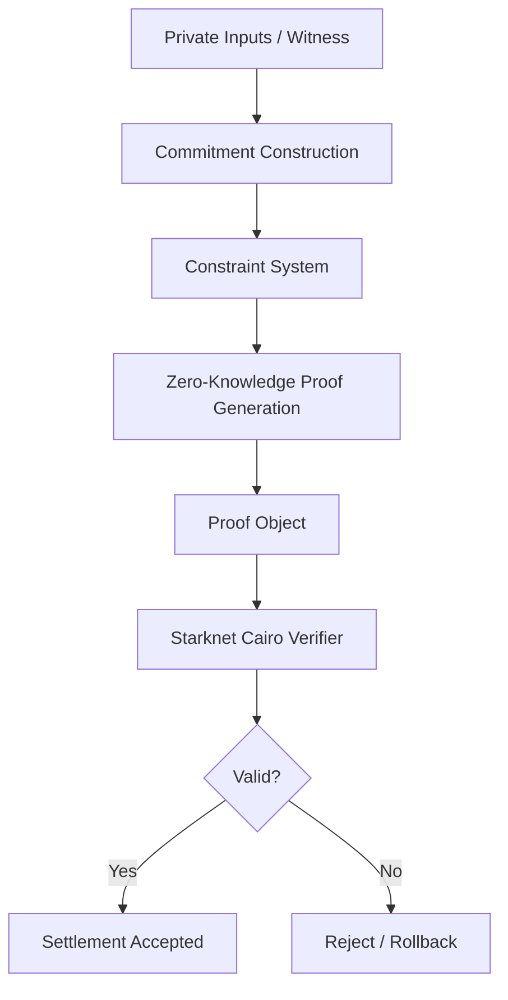

# BCYX ZK Verification

> Zero-knowledge proof layer for private coordination, selective disclosure, and batch settlement verification.

---

## Overview

BCYX uses Zero-Knowledge Proofs to verify that private swap, settlement, or oracle actions are valid without revealing:
- balances,
- counterparties,
- routing paths,
- internal execution state,
- or sensitive compliance inputs.

The verification layer is the cryptographic boundary between:
- private coordination,
and
- public settlement finality.

Its purpose is to let BCYX prove that something is correct, while keeping the underlying data hidden.

---

## Why ZK Verification Is Needed

Without zero-knowledge verification, BCYX would still leak too much information.

Even if commitments are hidden, the system still needs to prove that:
- a swap is valid,
- a settlement condition is satisfied,
- a nullifier has not been reused,
- a disclosure rule passed,
- and a batch of actions is consistent.

ZK proofs solve this by allowing BCYX to state:

```text
"I know valid private data
that satisfies the protocol rules"
````

without revealing the private data itself.

---

## What BCYX Proves

BCYX ZK verification is used to prove:

* commitment validity
* swap correctness
* settlement consistency
* nullifier correctness
* balance conservation
* selective disclosure predicates
* batch inclusion consistency
* accumulator-root consistency

The exact statements can change by use case, but the pattern is always the same:
private witness, public statement, cryptographic proof.

---

## Core Verification Model

BCYX uses a two-layer model:

### Layer 1 — Public State

The network sees:

* commitment roots,
* accumulator roots,
* nullifiers,
* batch proof roots,
* and settlement anchors.

### Layer 2 — Private Witness

The prover keeps secret:

* amounts,
* identities,
* routes,
* matching logic,
* and private execution state.

The verifier checks that the proof is valid relative to the public state.

---

## Verification Flow



---

## Proof Inputs

A BCYX proof may include:

* commitment preimages,
* Merkle inclusion paths,
* swap state witnesses,
* nullifier secrets,
* predicate witnesses,
* batch membership data,
* and accumulator consistency data.

These inputs are never published directly.

---

## Public Inputs

The verifier only sees:

* root hashes,
* commitment identifiers,
* accumulator roots,
* proof commitments,
* nullifiers,
* threshold values,
* and protocol parameters.

The public inputs define what the proof must satisfy.

---

## Verification Targets

### 1. Swap Validity

Proof that a confidential swap satisfies the rules of BCYX-SWAP.

Example:

* BTC locked,
* counterparty matched,
* output commitment created,
* no double-spend occurred.

---

### 2. Settlement Integrity

Proof that settlement is internally consistent.

Example:

* inputs match outputs,
* atomic conditions are met,
* settlement can finalize safely.

---

### 3. Selective Disclosure

Proof that a private condition holds without revealing the hidden value.

Example:

* `amount > threshold`
* `counterparty is approved`
* `swap occurred before deadline`

---

### 4. Nullifier Validity

Proof that a note or commitment has not already been spent.

This prevents:

* replay,
* double execution,
* and duplicate settlement claims.

---

### 5. Batch Verification

Proof that many private actions are all valid under one aggregated proof.

This is critical for:

* scalability,
* reduced on-chain cost,
* and compressed settlement coordination.

---

## Cairo Verifier Role

BCYX uses a Starknet Cairo verifier contract as the public verification endpoint.

The verifier:

* checks proof validity,
* checks accumulator roots,
* checks nullifiers,
* stores verified settlement state,
* and triggers finalization events.

The verifier does not learn private witness data.

---

## Suggested Contract Interface

```text
verify_swap_proof(
    proof,
    public_inputs,
    accumulator_root,
    nullifier
) -> bool

verify_batch_proof(
    batch_proof,
    batch_root,
    public_inputs
) -> bool

verify_disclosure_proof(
    proof,
    predicate,
    public_inputs
) -> bool
```

The exact interface can evolve, but the goal is consistent:
verify correctness without revealing internals.

---

## Batch Proof Verification

BCYX prefers batch verification when possible.

Instead of verifying each swap separately:

```text
Swap1
Swap2
Swap3
Swap4
```

BCYX aggregates them into:

```text
Single Batch Proof
```

This lowers:

* verifier cost,
* gas cost,
* coordination overhead,
* and settlement latency.

---

## Accumulator Relationship

ZK verification is tightly coupled to the accumulator layer.

The accumulator provides:

* the canonical root of private state,
* the commitment history,
* and the batch boundary for verification.

The proof shows that:

* the hidden actions are valid,
* and they correspond to the published accumulator root.

---

## Security Assumptions

BCYX ZK verification assumes:

* collision-resistant hashing,
* sound proof generation,
* correct constraint encoding,
* and honest public input construction.

The verifier is only as strong as:

* the proof system,
* the accumulator state,
* and the contract logic that checks them.

BCYX does not rely on trusted observers to interpret private state.

---

## Rollback and Failure Handling

If verification fails:

* the settlement is not finalized,
* the batch is rejected,
* and recovery or refund logic can be triggered.

This is important for BCYX-SWAP because atomicity must remain intact:
either all conditions pass, or the swap does not complete.

---

## Verification Properties

BCYX ZK verification is designed to preserve:

* **Soundness** — false claims should fail.
* **Zero-knowledge** — private inputs remain hidden.
* **Consistency** — proof and accumulator state must match.
* **Atomicity** — partial completion must not leak value.
* **Scalability** — many actions should compress into one verification path.

---

## PoC Use in BCYX-SWAP

For the proof-of-concept swap mechanism between BTC and strkBTC, ZK verification is used to prove that:

1. BTC was locked under the expected conditions.
2. The swap intent matches the intended counterparty or pool rule.
3. The corresponding strkBTC output is valid.
4. The same commitment is not reused.
5. The swap belongs to a valid batch and accumulator state.

This lets BCYX coordinate the swap privately while keeping the final settlement publicly verifiable.

---

## Future Extensions

Future BCYX ZK verification modules may support:

* recursive proof composition,
* multi-chain predicate verification,
* proof markets,
* private oracle attestations,
* compliance-aware disclosure,
* and generalized confidential settlement logic.

---

## Summary

BCYX ZK verification is the cryptographic engine that makes private coordination possible.

It allows BCYX to prove:

* validity,
* consistency,
* atomicity,
* and selective disclosure

without revealing the private state behind those claims.

That is what turns BCYX from a concept into a verifiable private settlement protocol.
